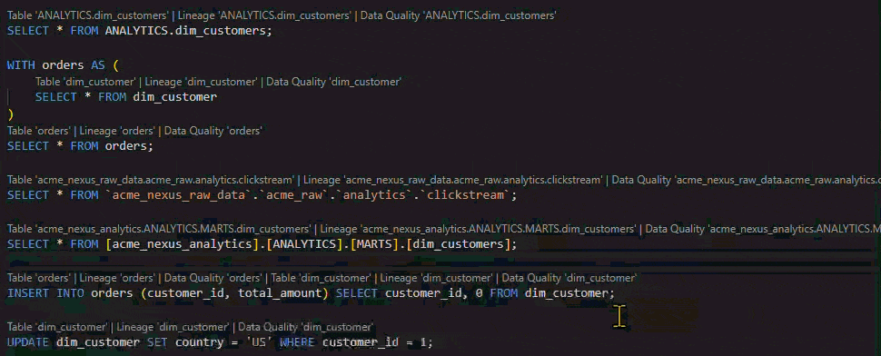
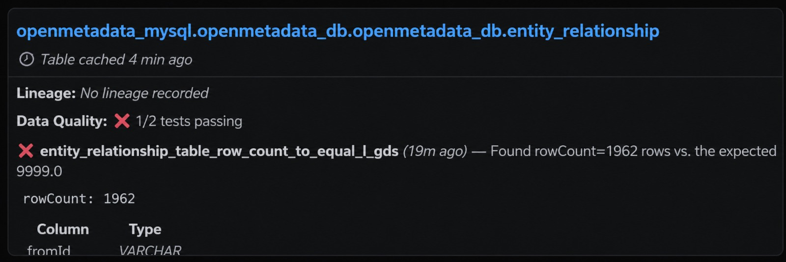
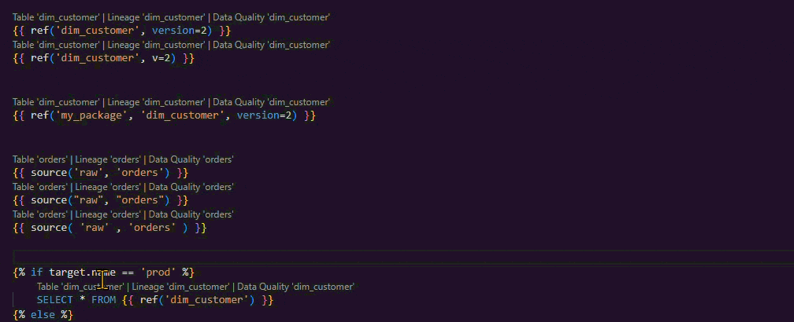
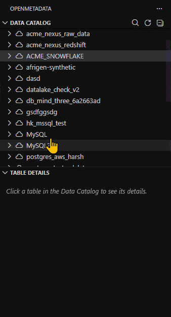
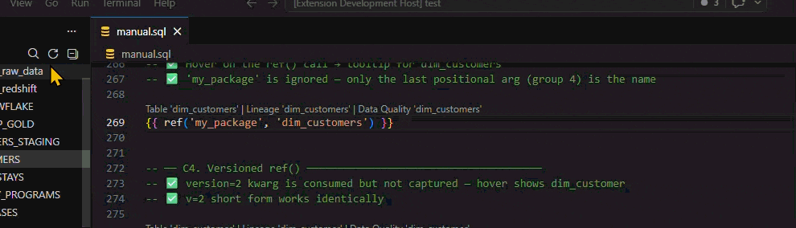

>**Disclaimer: AI assistance was used during the analysis phase and for generating boilerplate code and unit tests; all architecture decisions, core logic, and feature design are our own.**

# OpenMetadata for VS Code

Surface table descriptions, column types, data quality results, owners, tags, and lineage directly in VS Code while writing SQL or dbt Jinja — powered by the [OpenMetadata](https://open-metadata.org) REST API.

---

## Requirements

- A running OpenMetadata instance (self-hosted or [sandbox](https://sandbox.open-metadata.org))
- VS Code `1.100.0` or later
- A Personal Access Token from your OpenMetadata instance

---

## Features

### Hover Tooltips

Hover over any table name, `ref()`, or `source()` call in a `.sql` or `.jinja` file to see a tooltip with:
- Description, owners, and tags
- **Lineage** — upstream sources and downstream consumers, grouped by entity type
- **Data quality** — live pass/fail counts with details on failing tests
- Top 20 columns with data types
- Direct links to the table, lineage graph, and data quality results in the OpenMetadata UI
- Cache timestamp — shows when table metadata was last fetched

### CodeLens Actions
Three inline links appear above every line containing a table reference — including dbt `ref()` and `source()` calls:
- **Open** — opens the table detail page in your browser
- **Lineage** — opens the upstream/downstream lineage graph
- **Data Quality** — opens the data quality results for the table

### dbt Model Support

dbt models are fully supported — hover tooltips, CodeLens actions, and catalog browsing all work in `.jinja` and `.sql.jinja` files the same way they do in plain SQL.

### Data Catalog Sidebar

Browse your entire OpenMetadata instance from the Activity Bar:
- Databases, schemas, and tables are lazy-loaded on expand
- Clicking a table opens a **Table Details** panel with description, owners, tags, lineage, data quality, and columns
- **Refresh** button reloads the entire catalog tree and clears cached list data

### Smart Caching
Metadata is cached in memory with per-type TTLs to avoid redundant API calls:
- Table metadata and FQN lookups are persisted across VS Code restarts
- DQ results refresh every 2 minutes to stay current
- Document scan results are invalidated per keystroke, not on a timer
- Clearing auth (re-running Setup) flushes all cached data automatically
- The **Refresh** button in the Data Catalog sidebar also clears the cache and re-fetches everything from scratch
- Ambiguous FQN resolutions (table names that match more than one table in the catalog) are not cached and re-resolve on hovers

### Table Search

Fuzzy-search your catalog and open any table directly — triggered from either:
- The **search icon** in the Data Catalog sidebar
- The Command Palette (`Ctrl+Shift+P`) → **OpenMetadata: Search Table**

### Status Bar
The status bar shows the extension's connection status and surfaces error and warning notifications such as expired tokens or an unreachable server. Click the status bar item to re-run Setup.

### Commands
All extension actions are available as VS Code commands — used internally by CodeLens, the sidebar, and the status bar, but also callable directly from the Command Palette (`Ctrl+Shift+P`). See the [Commands](#commands) section for the full list.

---

## Supported File Types

| Language | Hover | CodeLens | dbt `ref()` / `source()` |
|----------|-------|----------|--------------------------|
| SQL (`.sql`) | Yes | Yes | Yes |
| Jinja SQL (`.jinja`, `.sql.jinja`, `.jinja.sql`) | Yes | Yes | Yes |

SQL table references (`FROM`, `JOIN`, `UPDATE`, `INTO`) and dbt model references (`ref()`, `source()`) are detected in the same scan pass. All standard `ref()` forms are supported: single-arg, cross-project (`ref('pkg', 'model')`), and versioned (`ref('model', version=2)`).

**Using a different extension for your dbt models?** To add support, open the extension's `package.json`, find the `languages` → `extensions` array under the `jinja-sql` entry, and add your extension:
`"extensions": [".jinja", ".sql.jinja", ".jinja.sql", ".j2"]`

---

## Installation

Search for **OpenMetadata** in the VS Code Extensions panel (`Ctrl+Shift+X`) and click **Install**.

Or install directly from the [Visual Studio Marketplace](https://marketplace.visualstudio.com/items?itemName=openmetadata-vscode.openmetadata).

---

## Setup

1. Press `Ctrl+Shift+P` and run **OpenMetadata: Setup (Connect)**
2. Enter your OpenMetadata server URL (e.g. `https://sandbox.open-metadata.org`)
3. Paste your Personal Access Token

Your token is stored using VS Code's `SecretStorage` API — backed by the OS keychain, never written to disk in plaintext.

### Generating a token
1. Log into the OpenMetadata web UI
2. Click your profile avatar (top right) and go to **View Profile**
3. Open the **Access Tokens** tab
4. Click **Generate New Token**, choose an expiry, and copy it immediately

---

## Commands

| Command | Description |
|---------|-------------|
| OpenMetadata: Setup (Connect) | Connect to an OpenMetadata instance |
| OpenMetadata: Search Table | Search the catalog by table name |
| OpenMetadata: Open Table in Browser | Open a specific table in the OpenMetadata UI |
| OpenMetadata: View Lineage | Open the lineage graph for a table |
| OpenMetadata: View Data Quality | Open the data quality results for a table |
| OpenMetadata: Refresh Catalog | Reload the Data Catalog sidebar and clear cached list data |

---

## Troubleshooting

**Extension shows "Not connected"**
- Run **OpenMetadata: Setup (Connect)** and verify your server URL and token are correct.
- Make sure your OpenMetadata instance is reachable from your machine.

**Hover tooltips not appearing**
- Confirm the file is `.sql`, `.jinja`, `.sql.jinja`, or `.jinja.sql`.
- Check that the table name matches exactly what's in your OpenMetadata catalog.

**Token expired**
- Generate a new token from your OpenMetadata profile and re-run Setup.

**No tables showing in sidebar**
- Click the **Refresh** button in the Data Catalog panel.
- Verify your account has read access to the relevant databases in OpenMetadata.

---

## Current Status & Planned Features

**v0.1.0** — Initial release

**Planned**
- **Column-level hover** — hover on `alias.column_name` to see that column's description, data type, and tags
- **Additional DQ signal sources** — surface table profiler stats (row count, null %, min/max) alongside test results
- **Expanded catalog search** — search all entity types (services, databases, schemas, tables) not just tables; rename to "Search Catalog"
- **Retry with exponential backoff** — automatic retry on transient network errors in API calls
---

## Contributing

Contributions are welcome. Please open an issue or pull request on the [GitHub repository](https://github.com/anandv29/vscode-openmetadata).

**Authors**
- [Ammar A. Khan](https://github.com/Ammar-A-Khan) — [LinkedIn](https://www.linkedin.com/in/ammar-a-khan-x/)
- [Anand](https://github.com/anandv29) — [LinkedIn](https://www.linkedin.com/in/anandsharma01/)

---

## Support

- [Report a bug](https://github.com/anandv29/vscode-openmetadata/issues)
- [Request a feature](https://github.com/anandv29/vscode-openmetadata/issues)

---

## License

MIT
